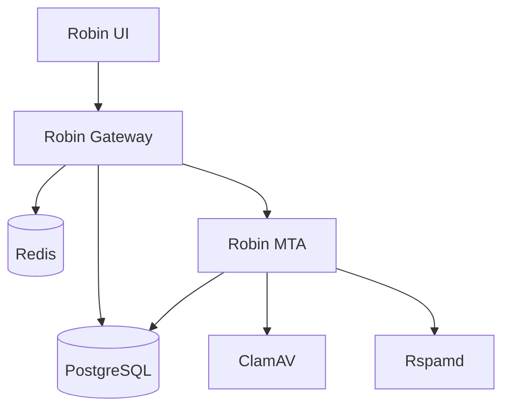

# Robin MTA Suite - Docker Architecture

This document explains the architecture, networking, and design decisions for the Robin MTA Docker setup.

## Table of Contents

1. [Overview](#overview)
2. [Architecture Diagram](#architecture-diagram)
3. [Service Dependencies](#service-dependencies)
4. [Network Configuration](#network-configuration)
5. [Data Flow](#data-flow)
6. [Security Considerations](#security-considerations)
7. [Scaling & Performance](#scaling--performance)

## Overview

The Robin MTA suite consists of three main application components and five infrastructure services:

### Application Components

1. **Robin UI** - Angular 18 frontend (Nginx in production, Node dev server in development)
2. **Robin Gateway** - Spring Boot 3.2 API Gateway (Java 21)
3. **Robin MTA** - Mail Transfer Agent (Java 21)

### Infrastructure Services

1. **PostgreSQL** - Shared relational database
2. **Redis** - Rate limiting and caching
3. **ClamAV** - Antivirus scanning
4. **Rspamd** - Spam and phishing detection
5. **Docker Network** - Internal communication

## Architecture Diagram

```
┌───────────────────────────────────────────────────────────────┐
│                         Internet                               │
└──────────────────────────┬────────────────────────────────────┘
                           │
                    ┌──────┴──────┐
                    │  Port 80/443 │
                    │  Port 25/587 │
                    └──────┬──────┘
                           │
┌──────────────────────────┴────────────────────────────────────┐
│                    Docker Host                                 │
│                                                                 │
│  ┌───────────────────────────────────────────────────────────┐│
│  │                  robin-network (bridge)                   ││
│  │                                                            ││
│  │  ┌─────────────┐                                          ││
│  │  │  Robin UI   │  Nginx (production) or Node (dev)       ││
│  │  │  Port: 80   │  Serves static Angular app              ││
│  │  └──────┬──────┘  Proxies /api/v1/* to Gateway           ││
│  │         │                                                  ││
│  │         ↓                                                  ││
│  │  ┌─────────────────────────────────────────────┐          ││
│  │  │           Robin Gateway                      │          ││
│  │  │           Port: 8080 (internal)              │          ││
│  │  │           Port: 8888 (external)              │          ││
│  │  │                                               │          ││
│  │  │  Features:                                   │          ││
│  │  │  - JWT Authentication                        │          ││
│  │  │  - Rate Limiting (Redis)                     │          ││
│  │  │  - Circuit Breakers                          │          ││
│  │  │  - Request Routing                           │          ││
│  │  │  - CORS Handling                             │          ││
│  │  └───────┬──────────────────┬───────────────────┘          ││
│  │          │                  │                               ││
│  │          ↓                  ↓                               ││
│  │  ┌──────────────┐   ┌──────────────┐                      ││
│  │  │ Robin MTA    │   │ Robin MTA    │                      ││
│  │  │ Service API  │   │ Client API   │                      ││
│  │  │ Port: 8080   │   │ Port: 8090   │                      ││
│  │  │              │   │              │                      ││
│  │  │ - Config     │   │ - Queue      │                      ││
│  │  │ - Metrics    │   │ - Storage    │                      ││
│  │  │ - Health     │   │ - Logs       │                      ││
│  │  └──────┬───────┘   └──────┬───────┘                      ││
│  │         │                  │                               ││
│  │         └──────────┬───────┘                               ││
│  │                    ↓                                       ││
│  │         ┌──────────────────────┐                          ││
│  │         │     Robin MTA Core   │                          ││
│  │         │  SMTP: 25, 587, 465  │                          ││
│  │         │                       │                          ││
│  │         │  - Mail Processing   │                          ││
│  │         │  - Queue Management  │                          ││
│  │         │  - Delivery          │                          ││
│  │         └──────────┬───────────┘                          ││
│  │                    │                                       ││
│  │    ┌───────────────┼───────────────┐                      ││
│  │    ↓               ↓               ↓                      ││
│  │ ┌────────┐   ┌──────────┐   ┌──────────┐                ││
│  │ │Postgres│   │  Redis   │   │ ClamAV   │                ││
│  │ │5432    │   │  6379    │   │  3310    │                ││
│  │ └────────┘   └──────────┘   └────┬─────┘                ││
│  │                                   │                       ││
│  │                              ┌────┴─────┐                ││
│  │                              │  Rspamd  │                ││
│  │                              │  11333   │                ││
│  │                              └──────────┘                ││
│  └───────────────────────────────────────────────────────────┘│
└─────────────────────────────────────────────────────────────────┘
```

## Service Dependencies

### Startup Order (Health Checks)

```
Level 0 (Foundation):
  └─ PostgreSQL (database)
  └─ Redis (cache)

Level 1 (Security):
  └─ ClamAV (depends on: none)
  └─ Rspamd (depends on: none)

Level 2 (Core):
  └─ Robin MTA (depends on: PostgreSQL, ClamAV, Rspamd)

Level 3 (Gateway):
  └─ Robin Gateway (depends on: PostgreSQL, Redis, Robin MTA)

Level 4 (Frontend):
  └─ Robin UI (depends on: Robin Gateway)
```

### Dependency Graph



## Network Configuration

### Bridge Network

All services communicate via a Docker bridge network named `robin-network`:

```yaml
networks:
  robin-network:
    driver: bridge
```

**Benefits**:
- Internal DNS resolution (services can reach each other by name)
- Network isolation from other Docker containers
- Automatic service discovery
- No need for port mapping for internal communication

### Service Discovery

Services use container names for DNS resolution:

```yaml
# Gateway connects to Robin MTA
ROBIN_SERVICE_URL=http://robin-mta:8080
ROBIN_CLIENT_URL=http://robin-mta:8090

# Gateway connects to database
DB_HOST=postgres

# Gateway connects to Redis
REDIS_HOST=redis

# Robin MTA connects to ClamAV
CLAMAV_HOST=clamav

# Robin MTA connects to Rspamd
RSPAMD_HOST=rspamd
```

### Port Mapping Strategy

**Exposed to Host** (external access):
- Robin UI: 80 (production) or 4200 (development)
- Robin Gateway: 8888
- Robin MTA SMTP: 25, 587, 465
- Robin MTA APIs: 8080, 8090
- Rspamd UI: 11334

**Not Exposed** (internal only):
- PostgreSQL: 5432
- Redis: 6379
- ClamAV: 3310
- Rspamd worker: 11333

**Production Recommendation**: Only expose 80/443, 25, 587. Use reverse proxy for gateway.

## Data Flow

### HTTP Request Flow

1. **User Request**: Browser → http://localhost/api/v1/queue/list
2. **Nginx**: Proxies to http://robin-gateway:8080/api/v1/queue/list
3. **Gateway**:
   - Validates JWT token
   - Checks rate limit (Redis)
   - Routes to http://robin-mta:8090/client/queue/list
4. **Robin MTA**: Processes request, queries database
5. **Response**: Robin MTA → Gateway → Nginx → Browser

### Authentication Flow

1. **Login**: UI → Gateway `/api/v1/auth/login`
2. **Gateway**:
   - Validates credentials (PostgreSQL)
   - Generates JWT token
   - Creates refresh token (HttpOnly cookie)
3. **Response**: Access token + HttpOnly cookie
4. **Subsequent Requests**:
   - UI sends access token in `Authorization` header
   - Gateway validates token
   - Gateway proxies to Robin MTA

### Mail Processing Flow

1. **SMTP Connection**: External mail server → Robin MTA:25/587
2. **Virus Scan**: Robin MTA → ClamAV:3310
3. **Spam Check**: Robin MTA → Rspamd:11333
4. **Queue**: Robin MTA → PostgreSQL (queue storage)
5. **Delivery**: Robin MTA → External mail server

## Security Considerations

### Network Security

1. **Internal Services**: PostgreSQL, Redis, ClamAV not exposed to host
2. **Authentication**: All API requests require JWT token
3. **Rate Limiting**: Redis-backed rate limiting prevents abuse
4. **Circuit Breakers**: Protect against cascading failures

### Database Security

1. **Shared Database**: Robin MTA and Gateway share PostgreSQL
2. **Separate Schemas**: Gateway uses Flyway migrations, Robin MTA uses its own schema
3. **Password Rotation**: Change `DB_PASSWORD` in `.env` before production

### JWT Security

1. **Dual Token Strategy**:
   - Access token (sessionStorage, 30 min)
   - Refresh token (HttpOnly cookie, 7 days)
2. **Secret Rotation**: Change `JWT_SECRET` in `.env` before production
3. **Token Expiration**: Automatic refresh before expiration

### TLS/SSL

**Not configured by default**. For production:

1. Add TLS certificates to nginx
2. Configure Robin MTA for TLS on SMTP ports
3. Use environment variable for certificate paths

## Scaling & Performance

### Horizontal Scaling

**Stateless Services** (can be scaled):
- Robin UI (nginx): Add load balancer
- Robin Gateway: Add multiple instances behind load balancer

**Stateful Services** (single instance recommended):
- Robin MTA: Use external queue (RabbitMQ) for multi-instance
- PostgreSQL: Use managed service or replication
- Redis: Use Redis Cluster or Sentinel

### Resource Allocation

**Minimum Requirements**:
```yaml
services:
  robin-mta:
    deploy:
      resources:
        limits:
          memory: 2G
        reservations:
          memory: 512M
```

**Recommended Production**:
- Robin MTA: 2-4 CPU, 2-4GB RAM
- Robin Gateway: 1-2 CPU, 1-2GB RAM
- PostgreSQL: 2-4 CPU, 4-8GB RAM
- Redis: 1 CPU, 1-2GB RAM
- ClamAV: 2 CPU, 2-4GB RAM

### Monitoring

**Metrics Endpoints**:
- Gateway: http://localhost:8888/actuator/prometheus
- Robin MTA: http://localhost:8080/metrics

**Health Checks**:
- All services have Docker health checks
- Automatic restart on failure

**Logs**:
```bash
# View all logs
docker compose -f docker-compose.full.yaml logs -f

# View specific service
docker compose -f docker-compose.full.yaml logs -f robin-gateway
```

## Volume Strategy

### Persistent Data

All data stored in Docker volumes:

```yaml
volumes:
  postgres-data:     # Database files
  redis-data:        # Redis persistence
  clamav-data:       # Virus definitions
  rspamd-data:       # Spam detection data
  robin-logs:        # Application logs
  robin-store:       # Mail queue and storage
```

### Backup Strategy

```bash
# Backup database
docker exec robin-postgres pg_dump -U robin robin > backup.sql

# Backup mail store
docker run --rm -v robin-mta-store:/data -v $(pwd):/backup alpine tar czf /backup/store-backup.tar.gz /data

# Restore database
cat backup.sql | docker exec -i robin-postgres psql -U robin robin

# Restore mail store
docker run --rm -v robin-mta-store:/data -v $(pwd):/backup alpine tar xzf /backup/store-backup.tar.gz -C /
```

## Configuration Management

### Environment Variables

Configuration hierarchy:
1. `.env` file (highest priority)
2. Docker Compose environment variables
3. Application defaults (lowest priority)

### Secrets Management

For production, use Docker secrets or external secret management:

```yaml
services:
  robin-gateway:
    secrets:
      - db_password
      - jwt_secret

secrets:
  db_password:
    external: true
  jwt_secret:
    external: true
```

## Deployment Patterns

### Development

```bash
docker-compose -f docker-compose.dev.full.yaml up -d
```
- Hot reload enabled
- Debug ports exposed
- Development profiles active

### Staging

```bash
docker-compose -f docker-compose.full.yaml up -d
```
- Production builds
- Health checks enabled
- No debug ports

### Production

1. Use orchestrator (Kubernetes, Docker Swarm)
2. External database (RDS, managed PostgreSQL)
3. Load balancer for Robin UI and Gateway
4. TLS/SSL termination
5. Log aggregation (ELK, Splunk)
6. Monitoring (Prometheus, Grafana)

## Troubleshooting

### Common Issues

1. **ClamAV takes 3+ minutes**: Normal, downloading virus definitions
2. **Gateway 502**: Robin MTA not ready, wait for health check
3. **Database connection refused**: PostgreSQL not ready, check health
4. **Port conflicts**: Change ports in `.env`

### Debug Commands

```bash
# Check service health
docker compose -f docker-compose.full.yaml ps

# View logs
docker compose -f docker-compose.full.yaml logs -f <service>

# Execute command in container
docker exec -it robin-gateway sh

# Check network connectivity
docker exec robin-gateway curl http://robin-mta:8080/health

# Restart service
docker compose -f docker-compose.full.yaml restart <service>
```

## Further Reading

- [Docker Setup Guide](DOCKER_SETUP.md) - Complete setup instructions
- [Quick Start](QUICKSTART_DOCKER.md) - 5-minute setup
- [Port Reference](PORTS_REFERENCE.md) - All ports and endpoints
- [Validation Script](scripts/validate.sh) - Health check automation
