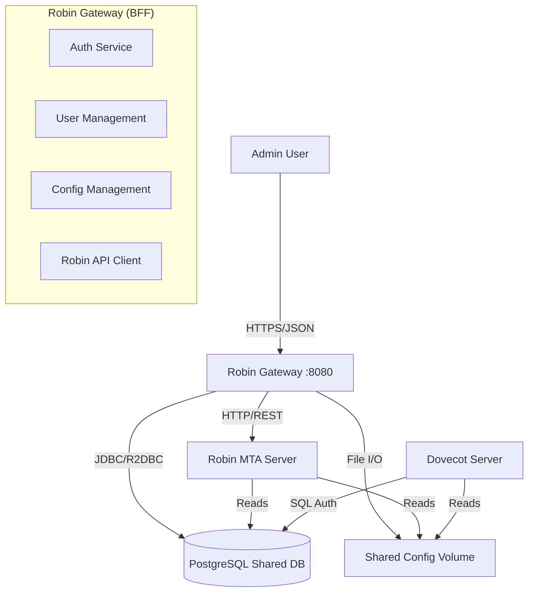

# Robin Gateway - Unified Backend Implementation Plan

## Executive Summary

**Role:** Primary Backend for Robin UI (BFF - Backend for Frontend)
**Architecture:** Hybrid Spring Boot Application (REST API + Proxy)
**Stack:** Amazon Corretto 21, Maven, Spring Boot 3.2, WebFlux, Spring Data JPA, R2DBC (optional for reactive), PostgreSQL.

**Core Responsibilities:**
1.  **Direct Database Management:** Owns the `users`, `domains`, and `aliases` tables shared with Dovecot and Robin.
2.  **Direct Configuration Management:** Reads/Writes configuration files (JSON5/YAML) for Robin, Dovecot, and scanners.
3.  **Robin MTA Integration:** Consumes Robin Client/Service APIs (8090/8080) for dynamic state (Queues, Metrics) and re-exposes them as polished JSON.
4.  **Security:** Centralized JWT Authentication and RBAC.

---

## 1. Architecture Diagram



---

## 2. Implementation Modules

### 2.1 Core & Security (`src/main/java/com/robin/gateway/core`)
*   **Security:** Spring Security with OAuth2 Resource Server (JWT).
*   **Token Provider:** Generates JWTs with custom claims (roles, permissions).
*   **CORS:** Global configuration allowing the Angular UI.
*   **Global Exception Handling:** Standardized JSON error responses.

### 2.2 User Management (Direct DB Access)
*   **Repository:** `UserRepository` accessing the shared `users` table.
*   **Features:**
    *   Create/Update/Delete Users (syncs instantly with Dovecot via DB).
    *   Password Hashing (SHA-512-CRYPT or ARGON2 to match Dovecot expectations).
    *   Manage quotas and permissions.

### 2.3 Configuration Management (Direct File Access)
*   **Service:** `ConfigurationService`
*   **Function:**
    *   Reads `cfg/*.json5` files from the shared volume.
    *   Parses them into Java POJOs (using Jackson/Gson).
    *   Updates specific fields and writes back atomically.
    *   **Trigger:** Calls Robin's `/config/reload` or executes shell commands (e.g., `doveadm reload`) if necessary.

### 2.4 Robin Integration (API Client)
*   **Service:** `RobinMtaService`
*   **Technology:** `WebClient` (Reactive).
*   **Endpoints to Wrap:**
    *   `GET /api/queue` -> Fetches from Robin `:8090/client/queue`, parses HTML/JSON, transforms to UI model.
    *   `POST /api/queue/retry` -> Proxies to Robin.
    *   `GET /api/metrics` -> Aggregates metrics from Robin `:8080`.

### 2.5 Dovecot Integration
*   **Method:**
    *   **Primary:** Shared Database (Users/Auth/Quota).
    *   **Secondary:** `DoveadmClient` (via Shell or Socket) to query live stats or force reload.

---

## 3. Data Model (Shared PostgreSQL)

The Gateway manages the schema that other services consume.

```sql
-- Managed by Flyway in Robin Gateway
CREATE TABLE users (
    id SERIAL PRIMARY KEY,
    username VARCHAR(255) NOT NULL UNIQUE, -- Email address
    password VARCHAR(255) NOT NULL,        -- {SCHEME}Hash
    quota_bytes BIGINT DEFAULT 0,
    is_active BOOLEAN DEFAULT TRUE,
    created_at TIMESTAMP DEFAULT NOW()
);

CREATE TABLE domains (
    id SERIAL PRIMARY KEY,
    domain VARCHAR(255) NOT NULL UNIQUE
);

CREATE TABLE aliases (
    id SERIAL PRIMARY KEY,
    source VARCHAR(255) NOT NULL,
    destination VARCHAR(255) NOT NULL
);
```

---

## 4. API Specification (UI Contract)

### Authentication
*   `POST /api/v1/auth/login`
*   `POST /api/v1/auth/refresh`

### System Management
*   `GET  /api/v1/users`
*   `POST /api/v1/users`
*   `PUT  /api/v1/users/{email}`
*   `GET  /api/v1/config/{section}` (storage, relay, network)
*   `PUT  /api/v1/config/{section}`

### Mail Operations (Proxied/Aggregated)
*   `GET    /api/v1/queue` (Paginated, Searchable)
*   `DELETE /api/v1/queue/{id}`
*   `POST   /api/v1/queue/flush`
*   `GET    /api/v1/storage`
*   `GET    /api/v1/health` (Aggregated status of Gateway + Robin + Dovecot + DB)

---

## 5. Development Phases

### Phase 1: Foundation (Day 1-2)
*   Setup Spring Boot with WebFlux and Data JPA.
*   Configure PostgreSQL connection.
*   Implement JWT Authentication.

### Phase 2: User Management (Day 3-4)
*   Implement `User` entity and Repository.
*   Implement Password hashing compatible with Dovecot.
*   Build CRUD endpoints.

### Phase 3: Configuration System (Day 5-6)
*   Implement File I/O service for `.json5` configs.
*   Map JSON structures to Java Classes.
*   Create Config endpoints.

### Phase 4: Robin Connector (Day 7-8)
*   Configure `WebClient`.
*   Implement Queue and Metrics bridging.
*   Add parsing logic if Robin returns HTML, or switch Robin to JSON (preferred).

### Phase 5: Polish & UI Integration (Day 9-10)
*   Global Error Handling.
*   CORS Setup.
*   Integration testing with Angular UI.

---

## 6. Docker Composition

The Gateway container must mount the same volumes as Robin and Dovecot.

```yaml
services:
  gateway:
    image: robin-gateway
    volumes:
      - ./cfg:/app/cfg:rw  # Shared Config
    environment:
      - DB_HOST=postgres
      - ROBIN_URL=http://robin:8090
      - DOVECOT_HOST=dovecot
```