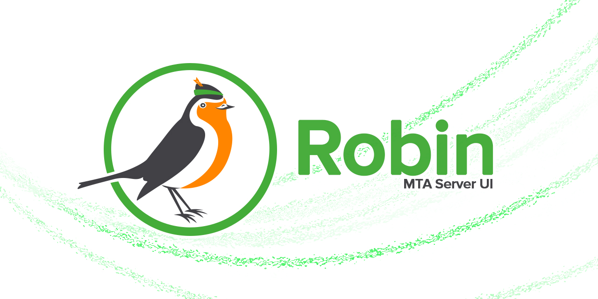

By **Vlad Marian** *<transilvlad@gmail.com>* and  **Cătălin Stan** *<https://github.com/foxglovelabs>*

Overview
--------
Robin MTA UI is a management interface for the Robin MTA server.

This makes it easier to manage domains, users, view logs, monitor queues, and configure various aspects of the server.

It is built using modern web technologies and provides a user-friendly experience for administrators.

Contributions
-------------
Contributions of any kind (bug fixes, new features...) are welcome!
This is a development tool and as such it may not be perfect and may be lacking in some areas.

Certain future functionalities are marked with TODO comments throughout the code.
This however does not mean they will be given priority or ever be done.

Any merge request made should align to existing coding style and naming convention.
Before submitting a merge request please run a comprehensive code quality analysis (IntelliJ, SonarQube).

Read more [here](contributing.md).

Disclosure
----------
This project makes use of sample password as needed for testing and demonstration purposes.

- notMyPassword - It's not my password. It can't be as password length and complexity not met.
- 1234 - Sample used in some unit tests.
- stark/potts/hogan - Another sample used in unit tests and documentation. (Tony Stark / Pepper Potts Easter egg)
- avengers - Test keystore password that contains a single entry issued to Tony Stark. (Another Easter egg)

**These passwords are not in use within production environments.**

## 📚 Documentation

Comprehensive documentation is available in the `docs/` directory.

### 🐳 Docker Setup (Recommended)
- **[Quick Start - Docker](docs/QUICKSTART_DOCKER.md)** ⭐ NEW - Get the complete suite running in 5 minutes
- **[Docker Setup Guide](docs/DOCKER_SETUP.md)** - Complete Docker documentation with all services
- **[Docker Architecture](docs/DOCKER_ARCHITECTURE.md)** - Architecture deep dive and design decisions
- **[Port Reference](docs/PORTS_REFERENCE.md)** - All ports and endpoints

### 🚀 Quick Start
- **[Quick Start Guide](docs/QUICK_START.md)** - Get started in 30 seconds (development)
- **[MASTER_DEVELOPMENT_PLAN.md](docs/MASTER_DEVELOPMENT_PLAN.md)** ⭐ NEW - Complete reference (1,324 lines)

### 📖 Core Documentation
- **[API Reference](docs/API_REFERENCE.md)** ⭐ NEW - All endpoints with examples (1,117 lines)
- **[Development Plan](docs/DEVELOPMENT_PLAN.md)** - Original 7-week roadmap (1,517 lines)
- **[Implementation Progress](docs/IMPLEMENTATION_PROGRESS.md)** - Current status (98% complete)
- **[Authentication Plan](docs/AUTH_IMPLEMENTATION_PLAN.md)** - Auth architecture (60KB)

### 📂 Component Documentation
- **Gateway**: [docs/gateway/](docs/gateway/) - Spring Boot API Gateway
- **UI**: [docs/ui/](docs/ui/) - Angular 21 SPA

**Full Documentation Index**: [docs/README.md](docs/README.md)

### 🎯 Project Status

| Component | Completion | Tests | Documentation |
|-----------|------------|-------|---------------|
| **Robin Gateway** | 98% | 69 integration tests | ✅ Complete |
| **Robin UI** | 98% | Unit + E2E tests | ✅ Complete |

**Ready for**: Manual testing, deployment
